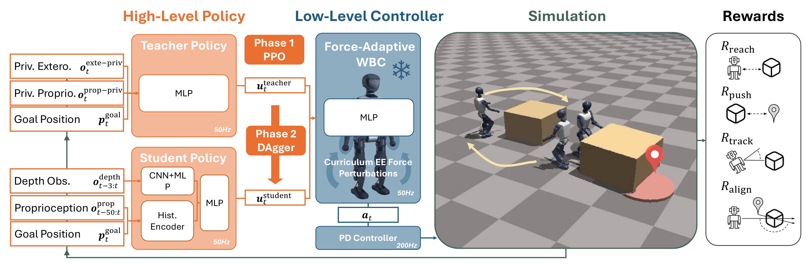

<style>
body {
  font-size: 16px;
  line-height: 1.55;
}

.project-button {
  margin: 5pt 20pt 30pt 20pt;
  height: 40px;
}

.project-button img {
  height: 30px;
}

.figure-caption {
  margin-top: 0.75rem;
  font-size: 15px;
  line-height: 1.35;
}

.policy-name {
  font-family: "Courier New", monospace;
  font-size: 0.96em;
  font-weight: 700;
  letter-spacing: 0.02em;
}

.policy-name-title {
  font-size: 1.12em;
}

.video-figure {
  margin: 1.5rem 0 2.25rem;
}

.video-figure video,
.video-card video {
  width: 100%;
  border: 1px solid #ddd;
  background: #000;
}

.video-grid {
  display: grid;
  grid-template-columns: repeat(2, minmax(0, 1fr));
  gap: 1.25rem;
  margin: 1.25rem 0 2rem;
}

.video-grid-three {
  grid-template-columns: repeat(3, minmax(0, 1fr));
}

.video-card h4 {
  margin: 0 0 0.5rem;
  font-size: 1.8rem;
  line-height: 1.25;
}

.label-icon {
  height: 1.25em;
  margin-left: 0.3rem;
  vertical-align: -0.18em;
  width: 1.25em;
}

.video-card p {
  margin-bottom: 0;
  font-size: 15px;
  line-height: 1.35;
  text-align: center;
}

.my-weight-slider {
  margin: 1.25rem 0 2rem;
  overflow: hidden;
  padding-bottom: 2rem;
  position: relative;
}

.my-weight-slider .swiper-wrapper {
  display: flex;
  gap: 16px;
  transition: transform 250ms ease;
}

.my-weight-slider .swiper-slide {
  flex: 0 0 calc((100% - 32px) / 3);
}

.my-weight-slider .swiper-button-prev,
.my-weight-slider .swiper-button-next {
  color: #fff;
  pointer-events: auto;
  top: 50%;
  z-index: 9999;
}

.my-weight-slider .swiper-button-prev {
  left: 8px;
}

.my-weight-slider .swiper-button-next {
  right: 8px;
}

.my-weight-slider .swiper-pagination {
  bottom: 0;
}

.my-weight-slider .swiper-pagination-bullet {
  background: #777;
  cursor: pointer;
  display: inline-block;
  height: 8px;
  margin: 0 4px;
  opacity: 0.35;
  width: 8px;
}

.my-weight-slider .swiper-pagination-bullet-active {
  opacity: 1;
}

@media (max-width: 760px) {
  .video-grid {
    grid-template-columns: 1fr;
  }
}

@media (max-width: 991px) {
  .my-weight-slider .swiper-slide {
    flex-basis: calc((100% - 16px) / 2);
  }
}

@media (max-width: 575px) {
  .my-weight-slider .swiper-slide {
    flex-basis: 100%;
  }
}

pre code {
  white-space: pre-wrap;
  word-break: break-word;
}
</style>

<div class="text-center">
  <a type="button" class="btn btn-link project-button" href="https://github.com/ut-amrl/VOFA">
    <h5>
       Code
    </h5>
  </a>

  <a role="button" class="btn btn-link project-button" href="https://huggingface.co/zichao22/vofa">
    <h5>
       Model
    </h5>
  </a>

  <a role="button" class="btn btn-link project-button" href="https://arxiv.org/abs/2605.01518">
    <h5>
       arXiv
    </h5>
  </a>
</div>

<div class="text-center video-figure">
  <video autoplay muted loop playsinline controls preload="metadata">
    <source src="assets/videos/sim/main_sim.mp4" type="video/mp4">
  </video>
</div>

<hr>

# Abstract

The ability to push large objects in a goal-directed manner using onboard egocentric perception is an essential skill for humanoid robots to perform complex tasks such as material handling in warehouses. To robustly manipulate heavy objects to arbitrary goal configurations, the robot must cope with unknown object mass and ground friction, noisy onboard perception, and actuation errors, all in a real-time feedback loop. Existing solutions either rely on privileged object-state information without onboard perception or lack robustness to variations in goal configurations and object physical properties.
In this work, we present <span class="policy-name">VOFA</span>, a visual goal-conditioned humanoid loco-manipulation system capable of pushing objects with unknown physical properties to arbitrary goal positions. <span class="policy-name">VOFA</span> consists of a two-level hierarchical architecture with a high-level visuomotor policy and a low-level force-adaptive whole-body controller. The high-level policy processes noisy onboard observations and generates goal-conditioned commands to operate in closed loop across diverse object-goal configurations, while the low-level whole-body controller provides robustness to variations in object physical properties.
<span class="policy-name">VOFA</span> is extensively evaluated in both simulation and real-world experiments on the Booster T1 humanoid robot. Our results demonstrate strong performance, achieving over 90% success in simulation and over 80% success in real-world trials. Moreover, <span class="policy-name">VOFA</span> successfully pushes objects weighing up to 17 kg, exceeding half of the Booster T1's body weight.

<hr>

# Method

<span class="policy-name">VOFA</span> uses a two-level hierarchy for visual goal-directed humanoid object pushing. A high-level visuomotor policy maps proprioceptive history, recent depth observations, and the target object goal to compact motion commands, while a frozen FALCON-based force-adaptive whole-body controller converts those commands into stable joint targets during contact-rich pushing. The high-level policy is trained with a privileged PPO teacher in IsaacGym and distilled into a vision-based student with DAgger. Rewards encourage reaching, pushing, visual tracking, and object-goal alignment, while domain randomization over object properties, scene geometry, camera extrinsics, and depth artifacts enables transfer to the real robot.

<div class="text-center">
  
</div>

<hr>

# Experiments

<h3><strong>[Simulation Ablation]</strong> Force-Adaptive Control</h3>

<div class="video-grid">
  <div class="video-card text-center">
    <h4>With Force-Adaptive WBC </h4>
    <video autoplay muted loop playsinline controls preload="metadata">
      <source src="assets/videos/sim/fa_sim.mp4" type="video/mp4">
    </video>
    <p>With the force-adaptive controller, the robot stably pushes the object using its end-effector.</p>
  </div>
  <div class="video-card text-center">
    <h4>Without Force-Adaptive WBC </h4>
    <video autoplay muted loop playsinline controls preload="metadata">
      <source src="assets/videos/sim/nofa_sim.mp4" type="video/mp4">
    </video>
    <p>Without it, the robot struggles to apply consistent forces and often resorts to kicking, causing instability.</p>
  </div>
</div>

<h3><strong>[Simulation Ablation]</strong> Object-Goal Alignment Reward</h3>

<div class="video-grid">
  <div class="video-card text-center">
    <h4>With Alignment Reward </h4>
    <video autoplay muted loop playsinline controls preload="metadata">
      <source src="assets/videos/sim/align_sim.mp4" type="video/mp4">
    </video>
    <p>The alignment reward enables the policy to reposition around the object before pushing it toward the goal.</p>
  </div>
  <div class="video-card text-center">
    <h4>Without Alignment Reward </h4>
    <video autoplay muted loop playsinline controls preload="metadata">
      <source src="assets/videos/sim/noalign_sim.mp4" type="video/mp4">
    </video>
    <p>Without it, the robot tends to make premature contact and fails to push the object to the goal.</p>
  </div>
</div>

<h3><strong>[Real World Deployment]</strong> Different Goal Positions</h3>

<div class="video-grid video-grid-three">
  <div class="video-card text-center">
    <h4>Left Goal</h4>
    <video autoplay muted loop playsinline controls preload="metadata">
      <source src="assets/videos/real/right_real.mp4" type="video/mp4">
    </video>
  </div>
  <div class="video-card text-center">
    <h4>Front Goal</h4>
    <video autoplay muted loop playsinline controls preload="metadata">
      <source src="assets/videos/real/front_real.mp4" type="video/mp4">
    </video>
  </div>
  <div class="video-card text-center">
    <h4>Right Goal</h4>
    <video autoplay muted loop playsinline controls preload="metadata">
      <source src="assets/videos/real/left_real.mp4" type="video/mp4">
    </video>
  </div>
</div>

<h3><strong>[Real World Deployment]</strong> Different Masses</h3>

<div class="swiper my-weight-slider py-2">
  <div class="swiper-wrapper">
    <div class="swiper-slide">
      <div class="video-card text-center">
        <h4>0 lb</h4>
        <video autoplay muted loop playsinline controls preload="metadata">
          <source src="assets/videos/real/0lb_real.mp4" type="video/mp4">
        </video>
      </div>
    </div>
    <div class="swiper-slide">
      <div class="video-card text-center">
        <h4>5 lb</h4>
        <video autoplay muted loop playsinline controls preload="metadata">
          <source src="assets/videos/real/5lb_real.mp4" type="video/mp4">
        </video>
      </div>
    </div>
    <div class="swiper-slide">
      <div class="video-card text-center">
        <h4>10 lb</h4>
        <video autoplay muted loop playsinline controls preload="metadata">
          <source src="assets/videos/real/10lb_real.mp4" type="video/mp4">
        </video>
      </div>
    </div>
    <div class="swiper-slide">
      <div class="video-card text-center">
        <h4>2.5 lb</h4>
        <video autoplay muted loop playsinline controls preload="metadata">
          <source src="assets/videos/real/2.5lb_real.mp4" type="video/mp4">
        </video>
      </div>
    </div>
    <div class="swiper-slide">
      <div class="video-card text-center">
        <h4>2.5 lb Goal Behind</h4>
        <video autoplay muted loop playsinline controls preload="metadata">
          <source src="assets/videos/real/2.5lb_real2.mp4" type="video/mp4">
        </video>
      </div>
    </div>
  </div>

  <div class="swiper-button-prev"></div>
  <div class="swiper-button-next"></div>
  <div class="swiper-pagination"></div>
</div>

<script>
  function initWeightSlider() {
    var slider = document.querySelector('.my-weight-slider');
    if (!slider || slider.dataset.ready === 'true') {
      return;
    }

    var track = slider.querySelector('.swiper-wrapper');
    var slides = Array.prototype.slice.call(slider.querySelectorAll('.swiper-slide'));
    var previous = slider.querySelector('.swiper-button-prev');
    var next = slider.querySelector('.swiper-button-next');
    var pagination = slider.querySelector('.swiper-pagination');
    var current = 0;

    function visibleCount() {
      if (window.innerWidth < 576) {
        return 1;
      }
      if (window.innerWidth < 992) {
        return 2;
      }
      return 3;
    }

    function maxIndex() {
      return Math.max(0, slides.length - visibleCount());
    }

    function renderPagination() {
      pagination.innerHTML = '';
      for (var index = 0; index <= maxIndex(); index += 1) {
        var bullet = document.createElement('span');
        bullet.className = 'swiper-pagination-bullet';
        bullet.setAttribute('role', 'button');
        bullet.setAttribute('aria-label', 'Show mass video set ' + (index + 1));
        bullet.dataset.index = index;
        bullet.addEventListener('click', function(event) {
          current = Number(event.currentTarget.dataset.index);
          update();
        });
        pagination.appendChild(bullet);
      }
    }

    function update() {
      current = Math.min(Math.max(current, 0), maxIndex());
      track.style.transform = 'translateX(-' + slides[current].offsetLeft + 'px)';
      previous.classList.toggle('swiper-button-disabled', current === 0);
      next.classList.toggle('swiper-button-disabled', current === maxIndex());
      Array.prototype.forEach.call(pagination.children, function(bullet, index) {
        bullet.classList.toggle('swiper-pagination-bullet-active', index === current);
      });
    }

    previous.addEventListener('click', function() {
      current -= 1;
      update();
    });

    next.addEventListener('click', function() {
      current += 1;
      update();
    });

    window.addEventListener('resize', function() {
      renderPagination();
      update();
    });

    slider.dataset.ready = 'true';
    renderPagination();
    update();
  }

  if (document.readyState === 'loading') {
    document.addEventListener('DOMContentLoaded', initWeightSlider);
  } else {
    initWeightSlider();
  }

  window.addEventListener('load', function() {
    if (!document.querySelector('.my-weight-slider[data-ready="true"]')) {
      initWeightSlider();
    }
  });
</script>

<h3><strong>[Demo]</strong> Closed-Loop Demonstration</h3>

<div class="video-grid">
  <div class="video-card text-center">
    <h4>Simulation Perturbation</h4>
    <video autoplay muted loop playsinline controls preload="metadata">
      <source src="assets/videos/sim/perturb_sim.mp4" type="video/mp4">
    </video>
    <p><span class="policy-name">VOFA</span> recovers after the object is externally disturbed during execution.</p>
  </div>
  <div class="video-card text-center">
    <h4>Real Off-Centered Mass</h4>
    <video autoplay muted loop playsinline controls preload="metadata">
      <source src="assets/videos/real/off_center_real.mp4" type="video/mp4">
    </video>
    <p><span class="policy-name">VOFA</span> adapts online when the object dynamics differ from the nominal setup.</p>
  </div>
</div>

<hr>

# BibTeX

```bibtex
@misc{hu2026vofavisualobjectgoal,
      title={VOFA: Visual Object Goal Pushing with Force-Adaptive Control for Humanoids}, 
      author={Zichao Hu and Zifan Xu and Dongsik Chang and He Yin and Linh Tran and Roberto Martín-Martín and Peter Stone and Jingyu Qiao and Joydeep Biswas},
      year={2026},
      eprint={2605.01518},
      archivePrefix={arXiv},
      primaryClass={cs.RO},
      url={https://arxiv.org/abs/2605.01518}, 
}
```
